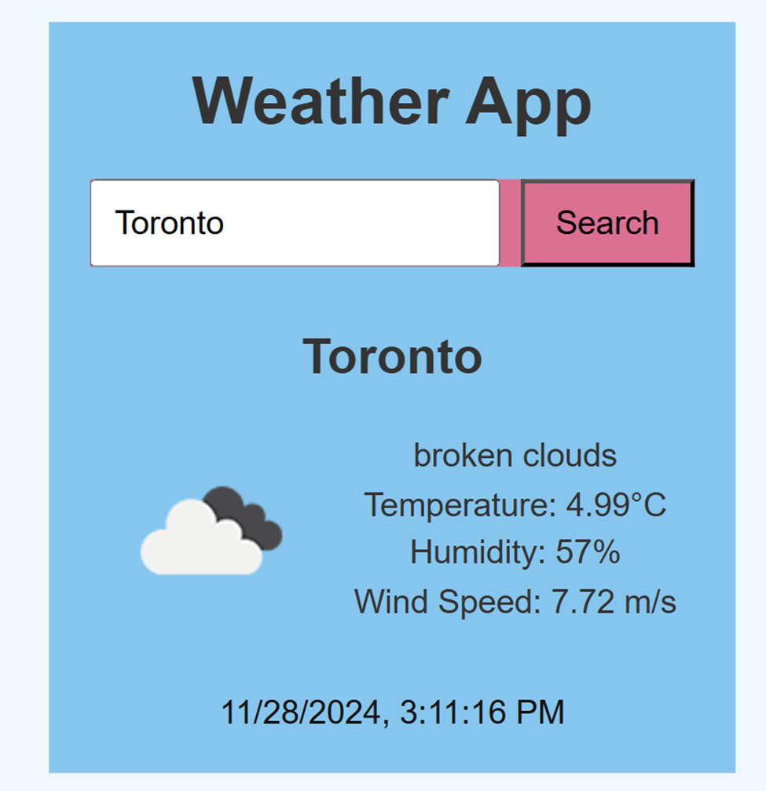
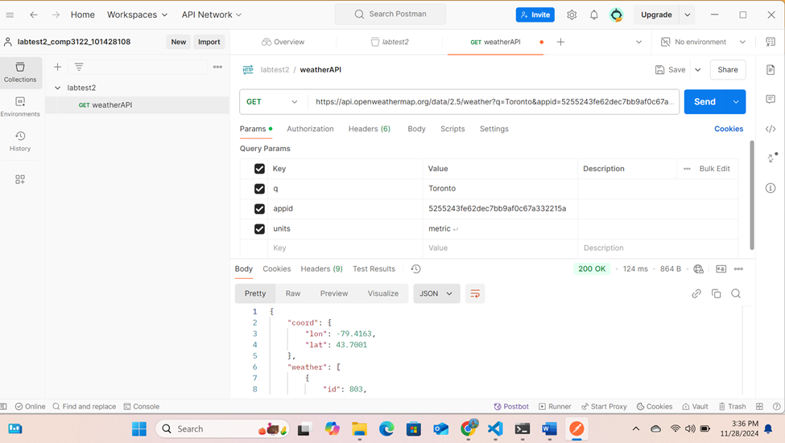

### Dhruvish Kanani 101428108

# Weather App - COMP 3123 Lab Test 2

## Features:
- **Search**: Users can search for the weather of any city.
- **Current Weather**: Displays the temperature, weather condition, humidity, and wind speed.
- **Weather Icon**: Shows an icon that corresponds to the current weather condition.
- **Responsive Design**: The app is designed to work on both desktop and mobile devices.

## Technologies Used:
- **ReactJS**: A JavaScript library for building user interfaces.
- **OpenWeatherMap API**: API to fetch weather data.
- **Axios**: For making HTTP requests.
- **CSS**: For styling the components.

## outputs :=

